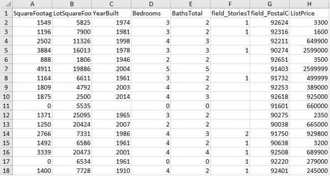
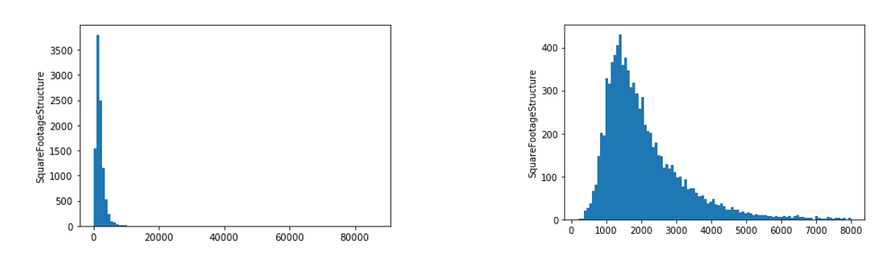

# California-Housing-Price-Estimation-Model
Housing price prediction model using neural networks

Housing Data in [resd_data.xlsx](resd_data.xlsx)

Removed some outlier data in follwing manner.
Removed Square Footage Structure smaller than 100 and bigger than 8000 Sqft.

* Used 4 Layer simple neural network with 128, 64, 16 and 1 neurons in layers.
* Used k fold validation process using 4 folds.
* Full report in [Report.pdf](Report.pdf)
* Full solution in [Price_prediction.ipynb](Price_prediction.ipynb)
